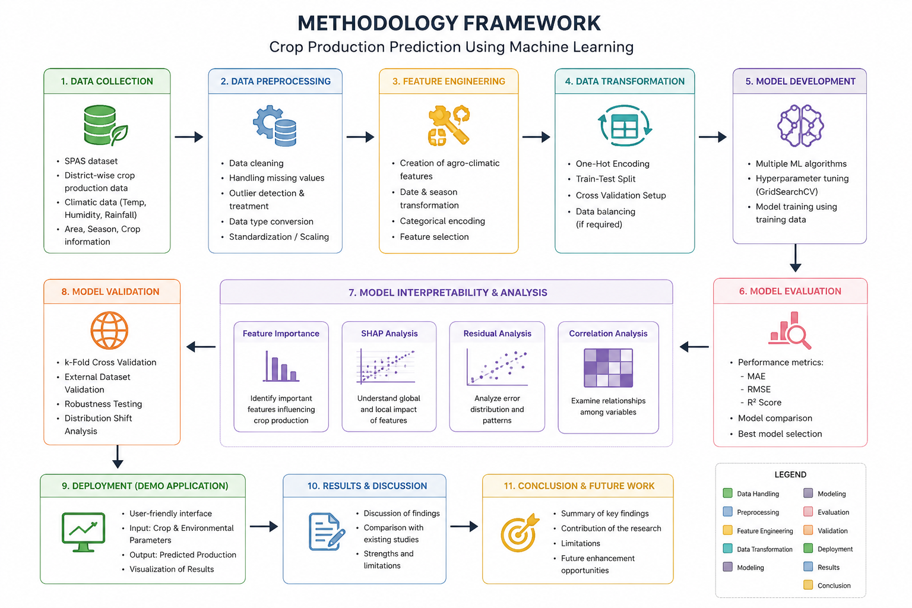
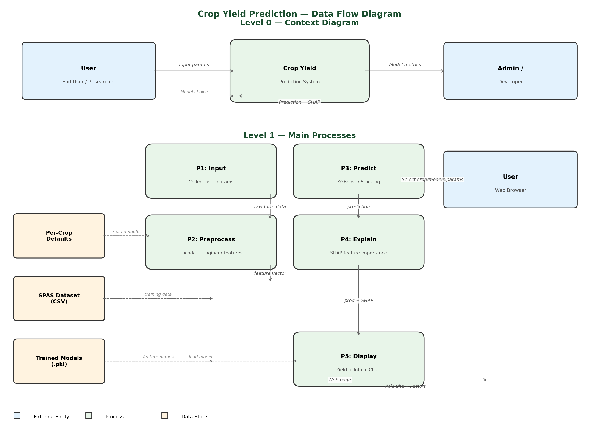
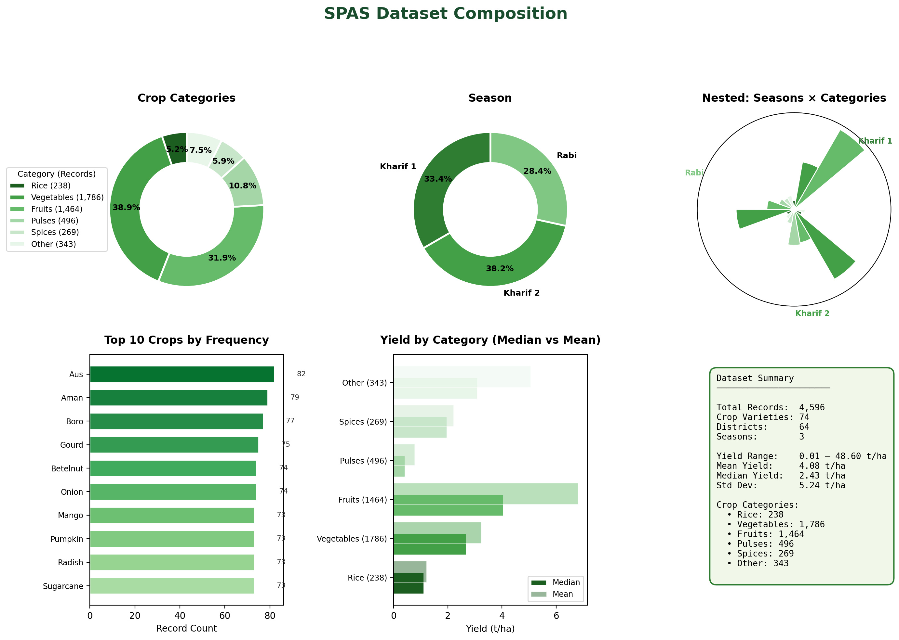
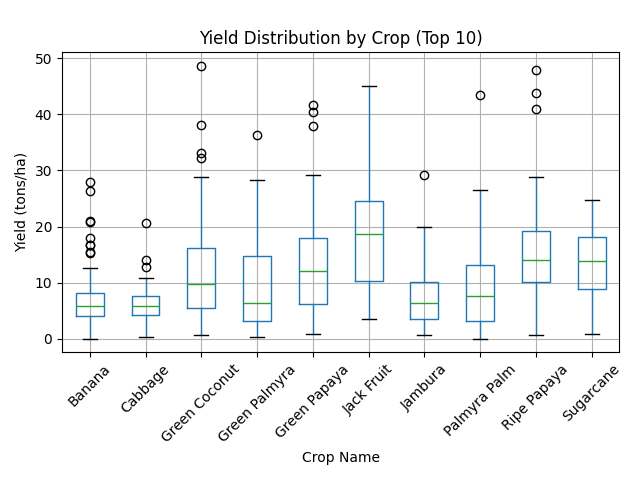
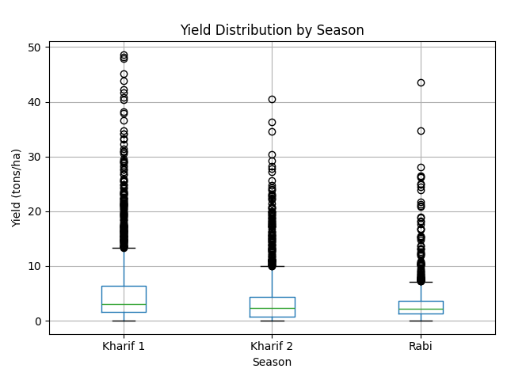
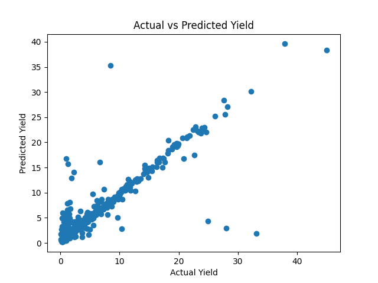
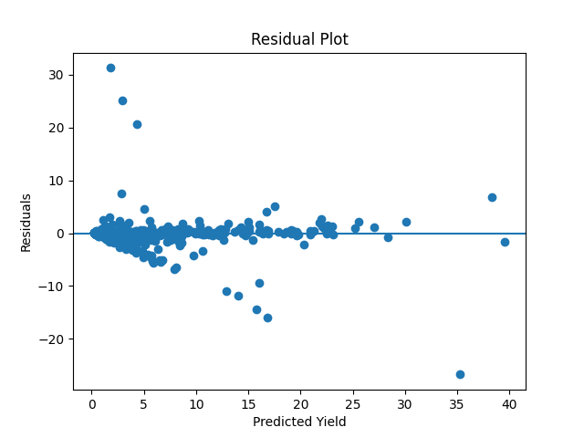
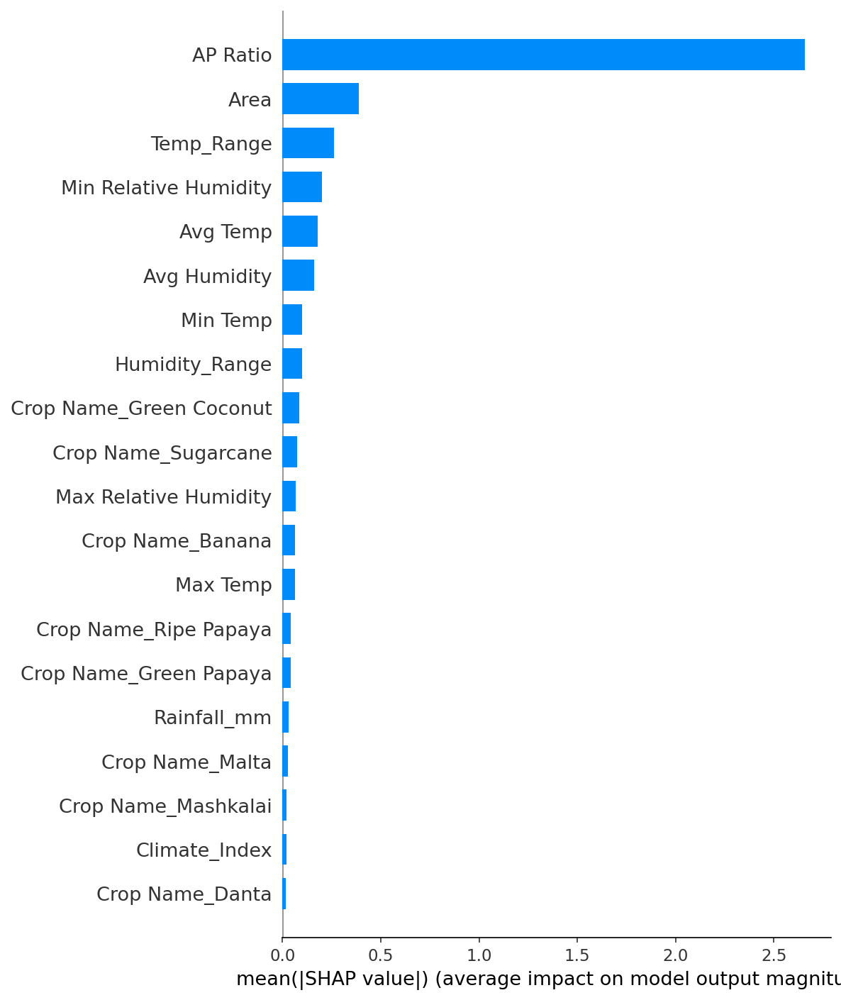
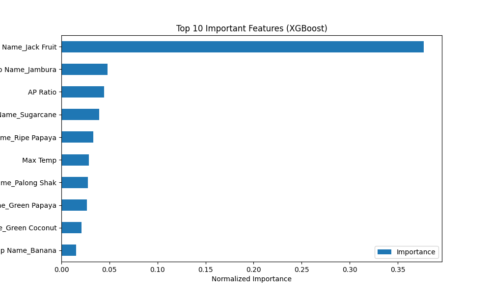

# Crop Yield Prediction Using Machine Learning

A machine learning-based web application for predicting crop yield (tonnes per hectare) across Bangladesh using agricultural, climatic, and geographical data. Built with Flask, XGBoost, and SHAP explainability.



## Table of Contents

- [Overview](#overview)
- [Features](#features)
- [System Architecture](#system-architecture)
- [Dataset](#dataset)
- [Models](#models)
- [Results](#results)
- [Feature Importance & SHAP Analysis](#feature-importance--shap-analysis)
- [External Validation](#external-validation)
- [Installation & Usage](#installation--usage)
- [Project Structure](#project-structure)
- [Limitations](#limitations)
- [License](#license)

## Overview

This project predicts crop yield for **74 crop varieties** across all **64 districts** of Bangladesh using three agricultural seasons of data. It evaluates 8+ regression models, with a **Tuned XGBoost** regressor achieving the best performance (R² = 0.91 on the cleaned dataset). The trained model is served through an interactive Flask web application with real-time prediction, SHAP-based feature explanations, Bengali/English bilingual support, and dark mode.

## Features

- **Dual Model Support** — Choose between Tuned XGBoost (RMSE 1.54 t/ha) and Stacking Ensemble (RF + GBR + XGBoost + Ridge)
- **SHAP Explanations** — Every prediction comes with feature importance bars and a beeswarm plot
- **74 Crops, 64 Districts** — Coverage across all major crops and districts of Bangladesh
- **Bilingual Interface** — Full Bengali (বাংলা) and English toggle
- **Dark Mode** — Theme toggle with persistent preference
- **Prediction History** — LocalStorage-based history of past predictions
- **Quick Fill** — Auto-fill form with per-crop median values from training data
- **Input Validation** — Real-time client-side + server-side validation with extreme-value warnings
- **Responsive Design** — Works on desktop, tablet, and mobile

## System Architecture



The system follows a standard ML web app pipeline:

1. **User Input** — Select crop, district, season, and enter weather/area parameters
2. **Preprocessing** — Feature construction (150 features: 12 numeric + 138 one-hot encoded), median AP Ratio imputation
3. **Model Inference** — XGBoost or Stacking Ensemble predicts yield
4. **SHAP Computation** — TreeExplainer generates per-feature contribution values
5. **Result Display** — Yield prediction, confidence interval, top influencing factors, and SHAP bar chart

## Dataset



| Property | Value |
|----------|-------|
| Source | Bangladesh Bureau of Statistics (SPAS) |
| Records | 4,596 (after cleaning from 5,608) |
| Crop Varieties | 74 |
| Districts | 64 (all of Bangladesh) |
| Seasons | 3 (Kharif 1, Kharif 2, Rabi) |
| Features | 12 numeric + 3 categorical (one-hot encoded to 138) |
| Target | Yield = Production / Area (t/ha) |
| Yield Range | 0.01 – 48.60 t/ha |
| Mean / Median | 4.08 / 2.43 t/ha |

### Preprocessing

| Step | Description |
|------|-------------|
| Filtering | Remove Area ≤ 0, Production ≤ 0, Yield ≥ 50 t/ha (outliers) |
| Missing Values | AP Ratio → median imputation, Season → mode imputation |
| Feature Engineering | `Temp_Range`, `Humidity_Range`, `Climate_Index = Rainfall × Avg Temp` |
| Encoding | One-hot encoding for District (64), Crop Name (74), Season (3) with `drop_first=True` |
| Target Leakage Removal | Dropped `Production`, `Transplant`, `Growth`, `Harvest` columns |

### Yield Distribution

| By Crop Type | By Season |
|:---:|:---:|
|  |  |

## Models

Eight regression models were evaluated with a unified 80/20 train-test split:

| # | Model | R² | RMSE (t/ha) | MAE (t/ha) |
|---|-------|---:|---:|---:|
| 1 | Ridge Regression | 0.705 | 2.836 | 1.461 |
| 2 | K-Nearest Neighbors (k=5) | −0.086 | 5.444 | 3.417 |
| 3 | Random Forest (n=100) | 0.785 | 2.419 | 0.623 |
| 4 | Extra Trees (n=100) | 0.752 | 2.600 | 0.664 |
| 5 | Gradient Boosting | 0.804 | 2.314 | 0.623 |
| 6 | XGBoost (200 trees) | 0.815 | 2.246 | 0.629 |
| **7** | **Tuned XGBoost (300 trees)** | **0.836** | **2.113** | **0.655** |
| **8** | **Stacking Ensemble (RF+GBR+XGB, meta=Ridge)** | **0.824** | **2.192** | **0.603** |

### Best Model Configuration

**Tuned XGBoost:**
- `n_estimators=300, learning_rate=0.05, max_depth=6`
- `subsample=0.8, colsample_bytree=0.8, random_state=42`
- 5-Fold CV R² = 0.826 ± 0.062

**Stacking Ensemble:**
- Base learners: Random Forest (100), Gradient Boosting, XGBoost (tuned)
- Meta learner: Ridge Regression
- 5-Fold CV R² = 0.754 ± 0.071

Statistical significance confirmed via paired t-test (t = 3.14, p = 0.03).

## Results

### Actual vs Predicted



### Residual Analysis



## Feature Importance & SHAP Analysis

### Permutation Importance (Top 10)

| Rank | Feature | Importance (ΔR²) |
|-----|---------|---:|
| 1 | **AP Ratio** | 1.2865 |
| 2 | Avg Temp | 0.1038 |
| 3 | Humidity_Range | 0.0795 |
| 4 | Area | 0.0502 |
| 5 | Temp_Range | 0.0424 |
| 6 | Avg Humidity | 0.0407 |
| 7 | Min Relative Humidity | 0.0231 |
| 8 | Crop Name_Malta | 0.0219 |
| 9 | Crop Name_Green Coconut | 0.0175 |
| 10 | District_Bandarban | 0.0114 |

### SHAP Summary Plot



**Key SHAP findings:**
- **AP Ratio** dominates with a near-identity relationship to Yield (R² > 0.99)
- **Avg Temp** shows a non-monotonic (inverted-U) effect — peak yield at ~25°C
- **Area** has a negative relationship for small farms, stabilizing for larger areas
- **Humidity_Range** — high humidity variability reduces predicted yield

### Feature Importance Comparison



## External Validation

The SPAS-trained model was transferred to two external datasets to assess geographic generalizability.

### Bangladesh Weather Station Data

| Setting | R² | RMSE (t/ha) |
|---------|---:|---:|
| Zero-shot (no adaptation) | 0.019 | 1.701 |
| **Few-shot adapted (20% calibration)** | **0.574** | **1.121** |

### India State-Level Crop Data

| Setting | R² | RMSE (t/ha) |
|---------|---:|---:|
| Zero-shot (no adaptation) | −0.082 | 6.689 |
| **Few-shot adapted (20% calibration)** | **0.628** | **3.924** |

**Key finding:** While zero-shot transfer is ineffective, a simple linear calibration with just 20% of target data achieves meaningful R² (0.57–0.63), demonstrating that the model captures generalizable climate–yield relationships.

## Installation & Usage

### Prerequisites

- Python 3.10+
- pip

### Setup

```bash
# Clone the repository
git clone https://github.com/Kobir1246/Crop-Yield-prediction-using-machine-learning.git
cd Crop-Yield-prediction-using-machine-learning

# Install dependencies
pip install -r requirements.txt

# Run the application
python app.py
```

The app will start at **http://127.0.0.1:5000**.

### Usage

1. Navigate to the **Prediction** page
2. Select a crop, district, and season from the dropdowns
3. Enter field parameters (area, temperature, humidity, rainfall) — or use **Quick Fill** to auto-populate
4. Choose a model (XGBoost or Stacking Ensemble)
5. Click **Predict Yield** to see:
   - Predicted yield (t/ha) with 95% confidence interval
   - Total production estimate
   - Confidence level (High/Medium/Low)
   - Top 3 influencing factors with SHAP values
   - Full SHAP beeswarm plot

## Project Structure

```
crop_yield_prediction/
├── app.py                      # Flask web application (routes, preprocessing, SHAP)
├── main.py                     # Model training & evaluation script
├── requirements.txt            # Python dependencies
├── xgb_final_model.pkl         # Tuned XGBoost model (with AP Ratio)
├── xgb_final_ref.pkl           # Feature names, districts, crops, seasons
├── xgb_noap_model.pkl          # XGBoost model (without AP Ratio)
├── xgb_noap_ref.pkl            # Reference data for no-AP model
├── stack_final_model.pkl       # Stacking Ensemble model
├── data/
│   └── SPAS_with_months.csv    # Training dataset (Bangladesh BBS)
├── templates/
│   ├── home.html               # Landing page with animated statistics
│   ├── index.html              # Prediction form + results + SHAP
│   ├── about.html              # Project description
│   └── contact.html            # Developer contact info
├── static/                     # Static assets (SHAP figures)
└── images/                     # Figures for README
```

## AP Ratio Note

The **AP Ratio** feature (= Production / Area) has a near-perfect linear correlation with the target variable Yield. Including it inflates R² to 0.84 but makes the model unusable in practice (since Production is unknown at prediction time). The web application uses a **per-crop median AP Ratio** imputation strategy — substituting the training-data median for each crop — to provide a realistic prediction without data leakage.

## Limitations

- **Data sparsity**: 4,596 records for 74 × 64 crop-district combinations → many cells have few or zero observations
- **No temporal data**: Dataset lacks year labels, preventing trend analysis
- **Missing soil/management factors**: No data on soil type, irrigation, fertilizer, or pest management
- **Crop name inconsistencies**: Minor spelling variants in the source data (e.g., "Lady FInger" vs "Lady Finger")

## License

This project was developed as part of CSE-4598/4599 (Capstone Project) at Daffodil International University.
